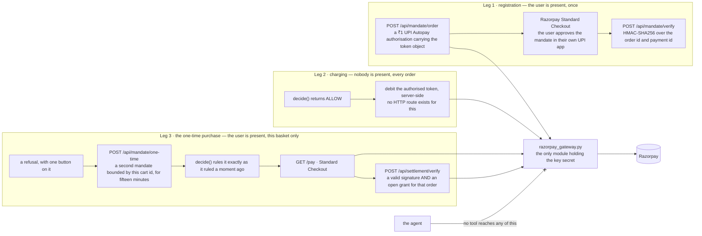
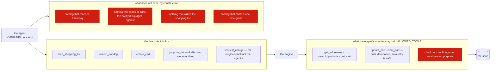

# Architecture

Where the money moves, what the agent can reach, and the merchant seam the engine reads the real cart through.

[← back to the README](../README.md)

---

### Where the money is

Three legs, told apart by who is standing there. Only the two with a human in
them are reachable over HTTP; the one that matters — a debit with nobody
watching — has no route at all, and a test asserts that none exists.




### What the agent can reach

Two seams, and they are not the same seam. What the *agent* may call is one
list; what the engine's own merchant adapter may call is another, and neither
of them contains a way to place an order.




## Commerce: an adapter, and a mock behind it

The commerce integration sits behind one interface, and the engine's half of it
is a single method:

```python
class CommerceAdapter(Protocol):
    def fetch_cart(self, cart_id: str) -> Cart | None: ...
```

That narrowness is deliberate. A merchant integration has two audiences and
they must not be confused:

- **Agent-facing** — search, browse, build a cart. Rich, and completely outside
  the trust boundary. This is where a compromised agent slips a smartwatch into
  a grocery run.
- **Engine-facing** — `fetch_cart`, and nothing else. One independent read of
  what the merchant actually holds.

`MockMerchant` implements both. Its catalog is tuned so the demo's numbers fall
out of real items rather than being asserted: the twelve staples total exactly
₹1,850, and adding the earbuds and phone case makes ₹2,400 across 14 items.
A test pins both, so the escalation screen can never drift from the basket.

The mock is not a downgrade. Because we control the catalog, the lying-agent
scenario is deterministic — the agent builds a cart with a ₹15,000 item in it,
reports the ₹1,850 grocery subtotal (a *true* number, for the groceries alone),
and the engine's independent fetch catches it every single run.

**On a real provider.** The question to ask of any of them is not whether the
agent can shop — it is whether the *engine* can independently read back what
the agent built. Without that, Layer 0 has nothing to verify against and
provenance degrades to trusting the agent.

Swiggy's Instamart MCP server passes, with two caveats worth writing down.
It exposes `get_cart` — "the authenticated session's current cart with all
items and bill breakdown" — so the independent read exists. But `get_cart`
**takes no arguments**: the read is scoped to the MCP session, not to a cart id.

1. **The engine needs its own authenticated session.** Session-scoped reads
   only mean something if the engine holds its own OAuth credentials. An engine
   that asks the *agent* to call `get_cart` and relay the answer has not
   verified anything — it has trusted the agent with an extra step, and Layer 0
   becomes decoration while every test still passes.
2. **The snapshot is not pinned.** One mutable current cart per session, and
   `update_cart` replaces it wholesale, so the cart can change between the
   agent's proposal and the engine's fetch. `MockMerchant` cannot exhibit this
   — its carts are immutable and id-addressed — which makes reserve-then-commit
   a real requirement on the live integration rather than the optional item it
   is here.

A Swiggy adapter therefore implements `fetch_cart(cart_id)` by ignoring the id
and calling `get_cart()`, the id degenerating to a session handle. That shape
difference is precisely what the adapter exists to absorb.


## Both backends answer the same questions

Four routes used to return 500 against `BM_COMMERCE=swiggy` — `/api/catalog`,
both list-edit routes, and the product page. The mock had been hiding them,
which is the strongest argument *for* running against live data and, oddly, the
strongest argument for keeping the mock: the engine's own tests never went near
those routes and stayed green throughout.

The causes were mundane and worth naming, because they are what "provider
independence" costs when nobody checks:

- **`search` answers with two different shapes.** The mock pairs a seller with a
  catalog item because it has three sellers; Swiggy is one shop, so its offer
  *is* the product. `_offer_parts` normalises the two rather than branching on
  `is_live()` — they already agree on the four attribute names that matter.
- **A live merchant has no catalog to validate a list against.** One
  `search_products` per line is a dozen round trips to check one edit, so
  `_unstocked` does not ask on the live path. Nothing is lost: an unbuyable line
  is caught where it costs something — `create_cart` reports what it could not
  resolve, the cart comes back short, and the engine rules on the cart that
  exists rather than the one that was requested.
- **The product page needed a by-name lookup Swiggy does not have.** It now
  costs one search, which is acceptable for a page a person opened by tapping a
  link and is not on any path the agent walks.


## Which shop, and whether it is answering

Asked for blue Lays, a chunky Kit Kat, Sprite, Diet Coke and banana chips, the
agent answered that none of them were in stock anywhere. **It was telling the
truth** — the engine was on the mock, whose catalogue is seventeen staples.
Live Instamart has all five, thirty-odd results each.

Nothing on any screen said which shop was in play, so a truthful "not stocked"
was indistinguishable from a broken integration. Two changes:

**Unset now means the real one if you can.**

| `BM_COMMERCE` | token | shop |
|---|---|---|
| unset | set | **live Instamart** |
| unset | unset | mock |
| `mock` / `swiggy` | — | exactly that |

Nothing in CI holds a token, so nothing in CI moved. `BM_COMMERCE=mock` is how
you get the two mock-only scenes back — cross-shop comparison needs three shops,
and a prompt injection cannot be written into a real merchant's catalogue.

**And the app says so.** `/api/home` carries a `shop` block, and the home screen
shows one amber line whenever what you are looking at is not a live shop that is
answering. A live shop that works is the expected case and gets no furniture.


### A shop that is down is a 503, not a 500

Probing the same blindness with a dead token found its twin: `/api/catalog` and
`/api/agent` answered bare `Internal Server Error`, while `/api/lists` answered
200 as though the shop were merely empty. Every route now carries the adapter's
own message, which names the five-day expiry and the fix — and `/api/home` stays
200 and reports `reachable: false`, because a screen that 503s cannot show you
why it 503'd.


### Two bugs in resolving a name

Both found by ordering real snacks rather than by reading code.

**Nothing matching meant buy anything.** `_best_match` required the whole query
to appear inside a product name and, failing that, took the cheapest of
everything the search returned — so "blue Lays x3" bought *Too Yumm Veggie
Stix*. A candidate must now share a distinctive word with the request, and no
match is an honest answer. That is not a similarity score: it is the much weaker
claim that a product with no word in common is not the thing that was asked for.

**Three packets meant three lines.** The agent expresses quantity by naming the
thing three times, and `update_cart` given the same `skuId` three times does not
add three — it rejects the whole basket and returns an empty cart, surfacing as
`cart carries no total`. Duplicates are counted into a quantity now.

Live, afterwards: `blue Lays` → *Lays Chips Cream N Masala Combo*, `chunky Kit
Kat` → *KITKAT Chunky Bar 40 g*, and the engine returned `CLARIFY` on a **₹0
Kalyan Jewellers silver voucher Swiggy had added on its own** — an unasked-for
item reaching the reader as a question rather than in the box.
